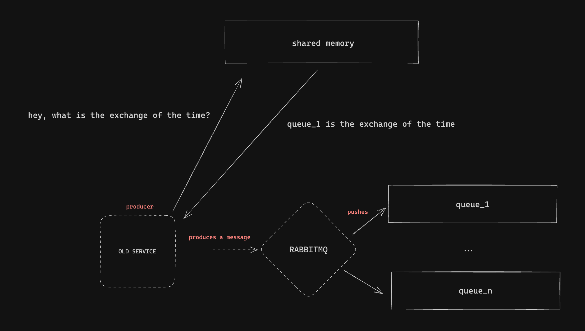

# Round Robin RabbitMQ

Testing some round robin technique when pushing messages to queues using RabbitMQ.

## Motivations

During a System Design Interview, I had the idea to deal with 100k+ requests using several queues and consumers.

The service who was receiving the calls is the producer, and I had the idea to scale the number of queues by the workload.

Several queues are deployed. Several consumers. One for each queue.

[By default RabbitMQ immediately dispatches (or pre-assigns) each message to the next consumer in sequence when it enters the queue. It dispatches messages evenly where where on average every consumer will get the same number of messages.](https://danmartensen.svbtle.com/rabbitmq-message-broker-patterns)

However, I this would work if we had one queue and several consumers, which it wasn't the case.

To achieve a round robin by the level of the producer, we might need to store a map with the exchanges (queues) and which one should receive the next package.




But what about having several producers connected to the same rabbitmq server? How can we sync between producers? Will this slow us down?

### RabbitMQ

Launch RabbitMQ using docker.

```bash
$ docker run -d --name rabbitmq -p 5672:5672 rabbitmq
```bash
